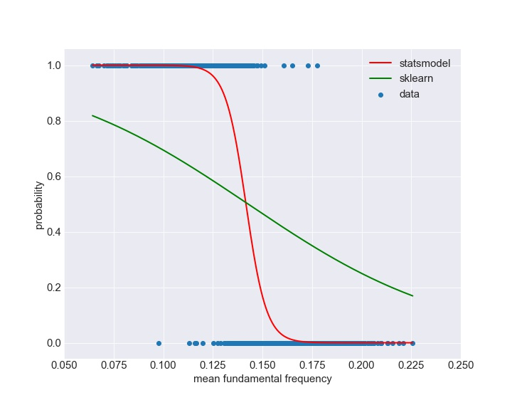

<!-- <script type="text/javascript" src="http://cdn.mathjax.org/mathjax/latest/MathJax.js?config=default"></script> -->
<!-- <script src='https://cdnjs.cloudflare.com/ajax/libs/mathjax/2.7.5/latest.js?config=TeX-MML-AM_CHTML' async></script> -->
<!-- <script src="https://cdn.mathjax.org/mathjax/latest/MathJax.js?config=TeX-AMS-MML_HTMLorMML" type="text/javascript"></script> -->
<!--  -->


# Identify gender of a voice

<!-- ## Table of Contents

1. [Introduction and EDA](#1.-Introduction-and-EDA)
	* [Motivation](#a.-Motivation)
	* [Exploratory data analysis](#b.Exploratory-data-analysis)
2. [Logistic regression](#Logistic-regression)
    * [Batch gradient descent](#)
    * [Stochastic gradient descent](#)
    * [Magic of sigmoid function](#)
3. [Perspective from Baysian](#)
3. [Concluding remarks](#) -->

## Introduction

The study of human voice recognition can be traced back to 1950s when the first baby talk system “Andrey” was invented from Bell Laboratory. However, Andrey only recognizes digits from single voice. Later on, IBM produced “Shoebox” with stronger ability to understand 16 English words. After several decades of development, voice recognition technology acquired tremendous improvement. The products, such as apple Siri, google home and Amazon Echo, can even interact with human and adapt to people’s lifestyle. This is mostly due to the state-of-the-art machine learning algorithm, as programming per se is not adequate to analyze the complexity of human voice. In this project, I would like to identify the gender of human voice by using logistic regression based on its binary nature.


Apple siri 					|   Amazon echo              |   Google home
:-------------------------:|:-------------------------:|:-------------------------:
</img>	|	</img> |	</img>
pic from apple.com | pic from amazon.com | pic from wikipedia

The dataset is from kaggle with 3618 recorded voice samples from 50% males and 50% females speakers. The samples are preprocessed by acoustic analysis into 21 features such as averge of fundamental frequency, interquantile range, spectral flatness and etc.


## Exploratory Data Analysis

There are 21 features in the dataset. However, not all of them are significant in determining the gender of voices. Below, we will sort out influential features from both visualization and quantitative analysis.

### 1. Visualization

Pairplot always bring the intuition of relations between features. Due to the linear nature of logistic regression, relevant features are usually the ones with clear decision boundary.

#### a. Pairplot and A/B Test

Sorting out features by eye-balling...

Strong correlated 			|   Wealy correlated           
:-------------------------:|:-------------------------:
</img>	|	</img> 
Separate peaks for different gender |  Hard to categorize linearly

The features with strong correlated character is more likely to help to differentiate voice by gender. This can be justified by conducting A/B test for the features that we want to test on. One expects to see a statistically significant difference between males and females for important features. For example, mean fundamental frequency could be very crucial in determining the gender of voices, see the plot below.


Because the difference of mean fundamental frequency between female and male is extremely significant (P_value=0)

```
t, p = stats.ttest_ind(df[ df['male']==1]['meanfun'], df[ df['male']==0]['meanfun'], equal_var=False)
```


Or there is a 98.90% probability that mean fundamental frequency of female is higher than male(from Bayesians).	

```
def bayesian_ab(a, b, num):
    male = a.sample(num).values
    female = b.sample(num).values
    prob = (female > male).mean() * 100

print(bayesian_ab(df[ df['male']==1]['meanfun'], df[ df['male']==0]['meanfun'], 1000)
```

#### b. Correlation Coefficient

Alternatively, one could calculate correlation coefficients between features to confirm the relationship in a more rigorous way. Below is heatmap of correlation coefficients between all features. The darker the color, the closer the relationship.

</img>

It is easy to refer that sd(standard deviation of frequency), Q25(first quantile), IQR(interquantile range), sp.ent(spectral entropy) and meanfun(meaning fundamental frequency) are more significant due to their large overlap with gender. This is consistent with our judgement by eye-balling. However, those features are also strongly "interact" with themselves, which might originate from collinear issue.

#### c. Variance Inflation Factors (VIF)

VIF is an important metric to detect colliearity among features. The general rule of thumb is that VIFs exceeding 4 warrant further investigation, while VIFs exceeding 10 are signs of serious multicollinearity requiring correction.

|      | sd    | meanfun | IQR   | Q25   | sp.ent |
|------|-------|---------|-------|-------|--------|
| VIFs | 72.15 | 40.6    | 27.99 | 27.77 | 149.78 |

Indeed, features above are not independent, as VIFs are insanely high. One bold thought came into my mind, what if I pick only one feature from them? But which one to pick?

### 2. Comparing mean of area under curve(AUC) using K-fold cross validation

To reduce the high bias and variance issue, I decided to choose the feature with the largest average AUC by utilizing k-fold cross validation. This can be done by plotting the ROC curve for one feature at a time. We found that the winner is mean fundamental frequency with surprisingly high AUC = 0.99, see below.

	

Mean of AUC for five one-feature models are given in the table below,


|             | meanfun(meaning fundamental frequency) | Q25(first quantile) | IQR(interquantile range) | sd (standard deviation of frequency) | sp.ent(spectral entropy) |
|:-----------:|:--------------------------------------:|:-------------------:|:------------------------:|:------------------------------------:|:------------------------:|
| Mean of AUC |                  0.99                  |         0.86        |           0.87           |                 0.79                 |           0.78           |

As the AUC of mean fundamental frequency is really high, we decided to keep this feature in our one-feature model.


## Logistic regression

### 1. Batch Gradient Descent

For one feature model, we can inplement  into the cost function and corresponding derivatives,


Update cofficient at each step  until cost function  reaches the minimum. The plot below is the learning curve of batch gradient descent.


</img>

Since the learning rate is large, the cost funtion oscillates crazily in the first 250 iterations. However, it converges very fast and reaches minimum at 430 iterations. The final coefficients obtained are very closed to the results from statsmodel.

| | |  |
|------------------|----------------|----------------|
| statsmodel       | 27.9           | -197           |
| gradient descent | 30.9           | -218           |


<!-- ### 2. Stochastic Gradient Descent

The disavantage of batch gradient descent is that convergence is very slow in particular when sample size is large. Stochastic gradient descent is an optimized algorithm with fast computation speed.
 -->


### 2. Threshold and Confusion Matrix

In classification problem, threshold is crucial in determining the outcome. Sometimes, accuracy is not the only important metric. A high threshold would increasing false negatives(type II error), while a low threshold would increase false positives(type I error). Confusion matrix makes it easier to balance these metrics. The plot below shows the trends of accuracy, recall, precision and F1 score by varying threshold.


There is a obvious tradeoff between ecall and precision, as they monotonically change for increasing threshold. However, accuracy and F1 score reach their maximum with threshold = 0.52. With the optimal threshold=0.52, a corresponding confusion matrix is given below.


| Accuracy | Precision | Recall | F1 score |  AUC |
|:--------:|:---------:|:------:|:--------:|:----:|
|    %94   |    93%    |   94%  |    93%   | 0.99 |

Based on high average of AUC, it is not surprising how great the performance of these metrics.


### 3. Magic of sigmoid function

It seems like our one-feature model worked really well under logistic regression. However, it is computationally expensive when the number of features and sample size become large. Essentially, sigmoid function uniquely confines any number to a interval between 0 and 1. What decides the outcome of training is threshold. In other words, it is not necesssay to compute the exact curvature from sigmoid function. Therefore, it is legitimate to replace sigmoid function by a straightline as long as they intersect at the same threshold. Such simple substition significantly reduced the work of computation. 


Sigmoid function versus Straightline	    |   Sigmoid function from of Sklearn and Statsmodel           
:------------------------------------------:|:-------------------------:
</img>	|	</img> 
 approximation in analytical vigor			| 	sklearn has faster computation speed

When we are using built-in functions, we do not really know what is inside the black box.
The plot on the right shows the sigmoid function generated from sklearn and statsmodel by using the same dataset. Statmodel yields standard sigmoid function while the sklearn generates an almost straight curve. Once the threshold is fixed, predictions above the threhold are treated positive while anything else is flagged negative. Accordingly, sklearn and statsmodel both lead to the same outcome. This approximation is remniscence of Relu(Rectified Linear Units) in Convolutional Neural Network.


## Perspective from Baysian

Running logistic regression 10 times from the same datset yields 10 sets of different coefficients  and . It is hard to determine which set of coeffcients is more reliable than others. In Bayesian language, coefficients come with credible level which quantifies the reliablity of coefficients. In this section, we will calculate the coefficients from Bayesian's perspective by using PYMC3. Coefficients initialized by a set of priors. A set of posterior will be obtained through Bayes formula below,


Then the posterior is treated as new prior and the above formula will be spammed over and over until the posterior becomes convergent and stablized.

```python
import pymc3 as pm

with pm.Model() as logistic:
    pm.glm.GLM.from_formula('male ~ meanfun', df, family=pm.glm.families.Binomial())
    start = pm.find_MAP()
    trace = pm.sample(10000)

pm.traceplot(trace)
```
The plot below gives a distribution of coefficients from a distributions of given priors.

</img>

Coefficients can be obtained as below and they are defined within a given credible interval.

|           | mean        | sd       | hpd_2.5     | hpd_97.5    |
|-----------|-------------|----------|-------------|-------------|
| Intercept | 26.623403   | 1.100775 | 24.490103   | 28.815384   |
| mean_fun  | -188.133888 | 7.817397 | -203.762016 | -173.143236 |

Now the coefficients are give explicitly with uncertainty(credible interval), e.g. it is 97.5% confident to say that  and 

(Note that hpd = highest posterior density = credible interval.)


## Concluding Remarks and Future Works

Conclusions
	
	
* We adopt an innovative way of choosing features in EDA by comparing the average AUC using k-fold cross validation. The model performs perfectly well with our one feature model which yields very high accuracy and f1 score.

* If more features are added, the model does not perform better. This is due to the following two reasons. Frist of all, logistic regression is essentially a linear model which limits its ability to account for nonlinear features. The feature with nonlinear decision boundaries were flagged with negligible impact even if they might contribute informations. Secondly, features of voice sample are mostly concerning frequencies. Therefore, features are mostly parallel with each other and thus no more distinct information is aquired from adding more features.
    

Future work:
 
* Implement stochastic gradient descent and compare it with batch gradient descent.
* Utilize support vector machine(SVM) with nonlinear kernel to take account nonlinear features and improve the metrics.
* Go beyond logistic regression: trying decision tree and etc.


## Acknowledgement

* I want to thank Frank, Erin, Kayla and Danny for their guidance and support.

* Dataset is from [Kaggle](https://www.kaggle.com/primaryobjects/voicegender/home).


