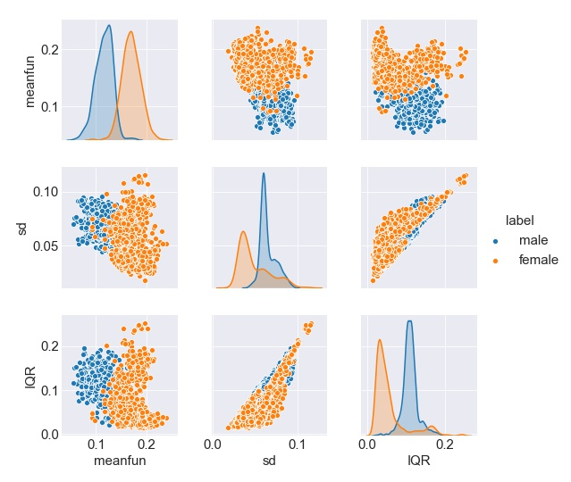
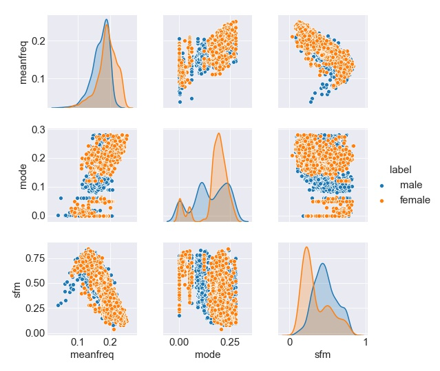
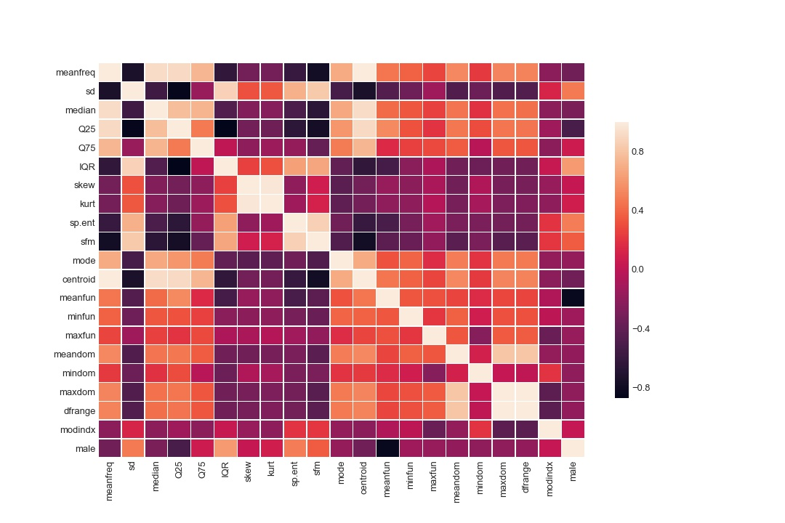
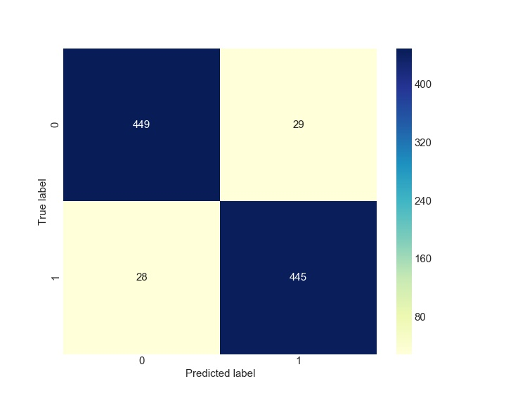
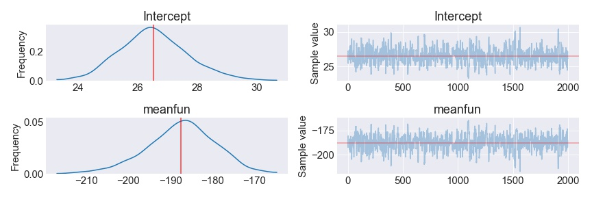

<!--  -->

<!--  -->

# Identify gender of a voice

## 1. Introduction and simple EDA

### i). Motivation

The study of human voice recognition can be traced back to 1950s when the first baby talk system “Andrey” was invented from Bell Laboratory. However, Andrey only recognizes digits from single voice. Later on, IBM produced “Shoebox” with stronger ability to understand 16 English words. After several decades of development, voice recognition technology acquired tremendous improvement. The products, such as apple Siri, google home and Amazon Echo, can even interact with human and adapt to people’s lifestyle. This is mostly due to the state-of-the-art machine learning algorithm, as programming per se is not adequate to analyze the complexity of human voice. In this project, I would like to identify the gender of human voice by using logistic regression based on its binary nature.

Apple siri 					|   Amazon echo              |   Google home
:-------------------------:|:-------------------------:|:-------------------------:
</img>	|	</img> |	</img>
pic from apple.com | pic from amazon.com | pic from wikipedia

The dataset is from kaggle with 3618 recorded voice samples from 50% males and 50% females speakers. The samples are preprocessed by acoustic analysis into 21 features such as averge of fundamental frequency, interquantile range, spectral flatness and etc.

### ii). Feature analysis

There are 21 features in the dataset. However, not all of them are significant in determining the gender of voices. Below, we will sort out influential features from both visualization and quantitative analysis.

#### Visualization

Pairplot always bring the intuition of relations between features. Due to the linear nature of logistic regression, relevant features are usually the ones with clear decision boundary.

##### Pairplot

Sorting out features by eye-balling...

Strong correlated 			|   Wealy correlated           
:-------------------------:|:-------------------------:
</img>	|	</img> 
Distinct peaks for different gender |  Hard to categorize linearly

##### Correlation coefficient

Alternatively, one could calculate correlation coefficients to confirm the relationship in a more rigorous way.

</img>

One could easily refer that sd(standard deviation of frequency), Q25(first quantile), IQR(interquantile range), sp.ent(spectral entropy) and meanfun(meaning fundamental frequency) are more significant due to their large overlap with gender. This is consistent with our judgement by eye-balling. However, they are strongly "interact" with themselves, which might originate from collinear issue.

##### Variance inflation factors (VIF)

VIF is an important metric to detect colliearity among features. The general rule of thumb is that VIFs exceeding 4 warrant further investigation, while VIFs exceeding 10 are signs of serious multicollinearity requiring correction.

|      | sd    | meanfun | IQR   | Q25   | sp.ent |
|------|-------|---------|-------|-------|--------|
| VIFs | 72.15 | 40.6    | 27.99 | 27.77 | 149.78 |

Indeed, features above are not independent. One bold thought came into my mind, what if I pick only one feature from them? Scratch head....but which one to pick?

#### Compare area under curve(AUC) using k-fold cross validation

To reduce the high bias and variance issue, I decided to choose the feature with the largest average AUC by utilizing k-fold cross validation. We found that the winner is mean fundamental frequency with surprisingly high AUC = 0.99, see below.

	

AUC = 0.86 			|   AUC = 0.79           
:-------------------------:|:-------------------------:
</img>	|	</img> 
first quantile |  standard diviation of frequency

AUC = 0.87 			|   AUC = 0.78           
:-------------------------:|:-------------------------:
</img>	|	</img> 
interquantile range |  spectral entropy

#### Perspectives from statisticans

Frequentist: The difference of mean fundamental frequency between female and male is extremely significant (P_value=0)

Bayesian: There is a 98.90% probability that mean fundamental frequency of female is higher than male.	

That is enough from EDA. Let us move on to see how good this one-feature model can be.

## 2. Logistic regression

### i). Confusion matrix and threshold

In classification problem, threshold is crucial in determining the outcome. Accuracy is not the only important metric. A high threshold would increasing false negatives(type II error), while a low threshold would increase false positives(type I error). Confusion matrix helps us to make the best decision.

From the plot above, recall and precision monotonically descreases and increases respectively. However, accuracy and f1 score reach their maximum with threshold = 0.51. With the optimal threshold=0.5, a corresponding confusion matrix is given below.

ROC cuve with AUC=0.99		|   Accuracy, recall, precison, f1 = 94%, 92%, 95%, 94%           
:-------------------------:|:-------------------------:
</img>	|	 </img> 

### ii). Magic of sigmoid function

It seems like our one-feature model worked really well under logistic regression. However, it is computationally expensive when the number of features and sample size become large. As Russian phyicist Landau said, the most important part of doing pysics is the knowledge of approximation. If we replace sigmoid function by a straightline and the intercept of straightline and sigmoid curvature coincides with threshold. The prediction is the same as the one from complex sigmoid function.

$$ h(x) = \frac{1}{1+e^{-x}} $$

Replace sigmoid function by a straightline	|   Comparison of sklearn and statsmodel           
:------------------------------------------:|:-------------------------:
</img>	|	</img> 
from analytical rigorous					| computationally cheaper

The rightplot shows the sigmoid function from sklearn and statsmodel. Statmodel yields standard sigmoid function while the curvature from sklearn is almost straight. Sklearn is physicist!

### iii). Gradient descent

Maybe we should try out our own recipe to train our model.

For one feature model, we have \\( z_i = \theta_0  + \theta_1 * x_i, \\). Plug it into cost function and its gradient,

$$
\begin{align}
&J = -\sum_{i=1}^n y_i \log(h(z_i)) + (1 - y_i) \log(1-h(z_i)) \\\\
&\text{grad} = \sum_{i=1}^n (h(z_i) - y_i) x_{ij}
\end{align}
$$

Update cofficient at each step \\( \theta = \theta - \alpha\*\text{grad} \\) until cost function \\(J\\) reaches the minimum.

</img>

Since the learning rate is large, the cost funtion oscillates crazily in the first 200 iterations. However, it converges very fast and reaches minimum with 430 iterations. The final coefficients obtained are very closed to the results from statsmodel.

|                  | \\(\theta_0\\) | \\(\theta_1\\) |
|------------------|----------------|----------------|
| statsmodel       | 27.9           | -197           |
| gradient descent | 30.9           | -218           |

Not too bad. But Bayesians are not satisified. Why coefficients are fixed?

## 3. Perspective from Baysian

Indeed, different samples lead to dfferent coefficients. How do you determine which set of coeffcients is more reliable than others? From Bayesians perspective, one need to provide a set of prior coefficients and throw them into "Bayesian machine" [ \\(p(a|b) \propto p(a)\*p(b|a)\\) ] to trade for a set of posteriors. For conjugate prior with normal distribution, posteriors also form a normal distribution. The following plot show the distributions of two coefficients in our one-feature logistic regression model by using PYMC3.

</img>

Consequently, coefficients are defined within a given credible intervel e.g. 95%.

|           | mean        | sd       | hpd_2.5     | hpd_97.5    |
|-----------|-------------|----------|-------------|-------------|
| Intercept | 26.623403   | 1.100775 | 24.490103   | 28.815384   |
| mean_fun  | -188.133888 | 7.817397 | -203.762016 | -173.143236 |

By passing our one-feature dataset into the "bayesian machine", it is 97.5% credible to say that \\(\theta_0=28.8\\) and \\(\theta_1 = -173.1\\).

Note that hpd = highest posterior density = credible interval.

## 4. Concluding remarks

We applied a one-feature model to identify the gender of voice. The model performs perfectly fine with very high accuracy and f1 score. We explored various ways of logistic regression. 

If more feature are added, the model does not perform better. It is an interesting question why one feature works perfectly well here.

Frist of all, logistic regression is linear model which limits its ability to account for nonlinear features. These feature with nonlinear decision boundaries have negligible impact. Support vector machine(SVM) with nonlinear kernel could resolve this issue and improve metrics.

Secondly, features of voice sample are mostly concerning frequencies. Accordingly, it is hard to make any progress by adding more features. Most features are parallel with each other.

## Acknowledgement

I want to thank Frank, Erin, Kayla and Danny for their support and guidance.

